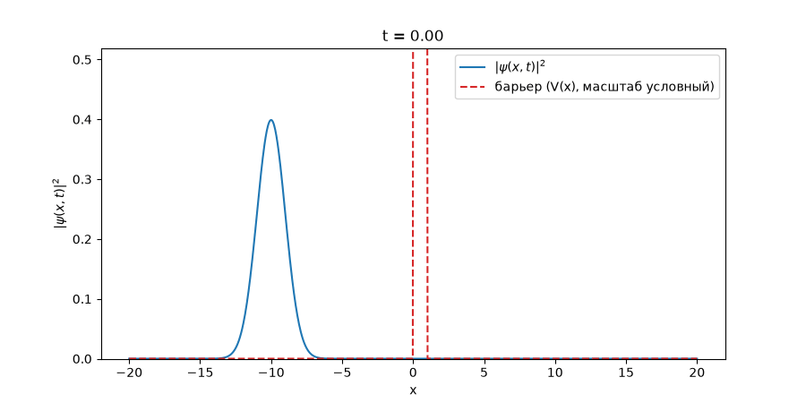

# quantumtunnelingvisualizer
1D quantum tunneling visualizer (Crank-Nicolson / Split-Step Fourier)

Визуализация квантового туннелирования частицы через потенциальный барьер:
численное решение нестационарного уравнения Шрёдингера (1D) двумя методами —
**Crank–Nicolson** и **Split-Step Fourier** — с последующей анимацией.

## Цель проекта

- [x] Реализовать метод Crank–Nicolson для 1D TDSE
- [ ] Реализовать Split-Step Fourier для 1D TDSE
- [ ] Сравнить методы на одном и том же волновом пакете/барьере
- [x] Сделать анимацию: |ψ|²
- [x] Посчитать коэффициенты отражения/пропускания
- [ ] Собрать финальное объяснение для сайта

## Физическая постановка

Уравнение (безразмерные единицы, ħ = m = 1):

i ∂ψ/∂t = [-1/2 ∂²ψ/∂x² + V(x)] ψ

Барьер: прямоугольный потенциал V(x) = V0 при x0 < x < x0+w, иначе V(x) = 0.

## Структура репозитория
notes/            — теория, выводы формул, конспекты
src/python/       — код методов
figures/          — сохранённые графики/gif

## Журнал разработки (Devlog)

### 2026-07-11
- Реализован метод Crank–Nicolson полностью: сетка, гауссов пакет, прямоугольный барьер, матрицы A/B, цикл эволюции на 2000 шагов.
- Норма сохраняется с точностью ~1e-12 на протяжении всей эволюции — метод работает корректно.
- Посчитаны коэффициенты: T ≈ 0.09 (туннелирование), R ≈ 0.90 (отражение) — при барьере V0=15, что заметно выше энергии пакета.
- Сделана анимация процесса, сохранена в figures/tunneling_animation.gif.
- Следующий шаг: реализовать Split-Step Fourier на том же барьере для сравнения методов.

### 2026-07-07
- Создан репозиторий, структура, README.
- Изучены методы: Crank–Nicolson и Split-Step Fourier.

## Источники

- Crank, Nicolson (1947), "A practical method for numerical evaluation of solutions of PDE of heat-conduction type"
- matterwavex.com — Crank–Nicolson / Split-Step Fourier guides for TDSE
- Physics LibreTexts — Split-Step Fourier Method (Computational Physics, Chong)

## Лицензия

MIT